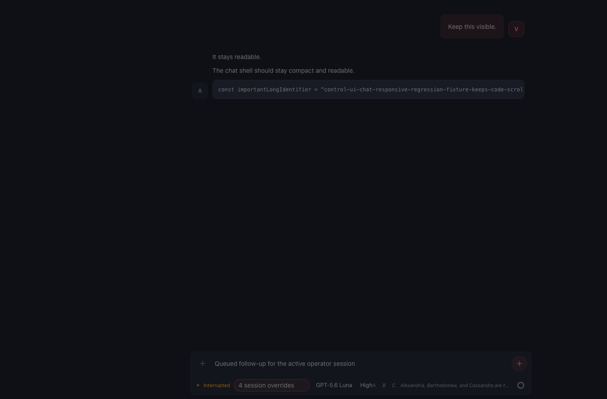
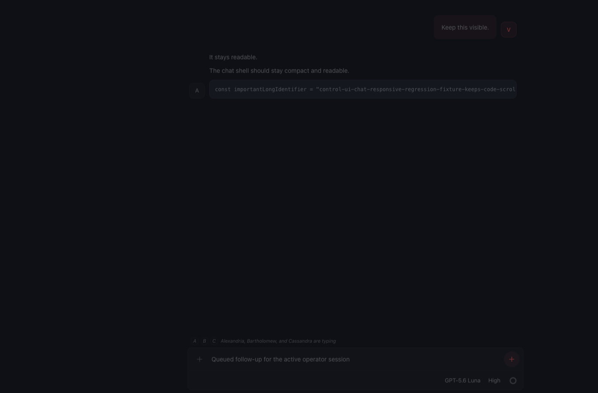

# OpenClaw PR 122809 visual proof

- Source PR: https://github.com/openclaw/openclaw/pull/122809
- Source head: `0293a132dd18d15c38b01df635448d3a314ca4e1`
- Scenario: another participant is actively typing while the composer model picker is visible
- Environment: real Chromium, 1366 × 900 viewport, existing chat responsive browser fixture
- Capture method: the repository browser test fixture rendered the base and changed revisions; temporary screenshot capture instrumentation was removed before the source commit

## Before

The typing indicator shares the composer footer and moves the model picker away from its idle position.

## After

The typing indicator renders in a dedicated row above the composer and the model picker remains right-aligned.

